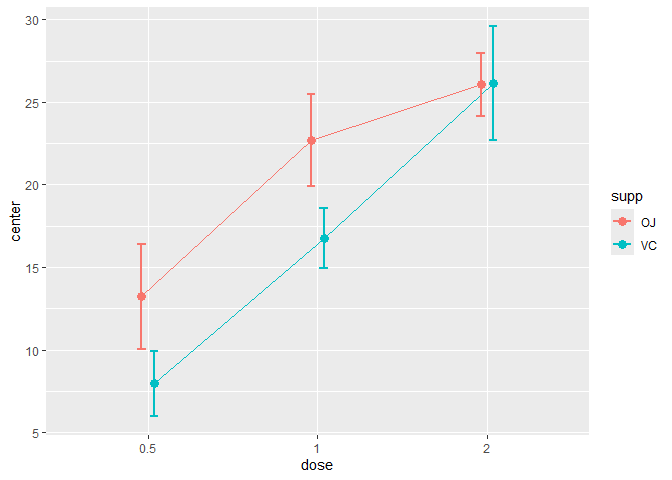
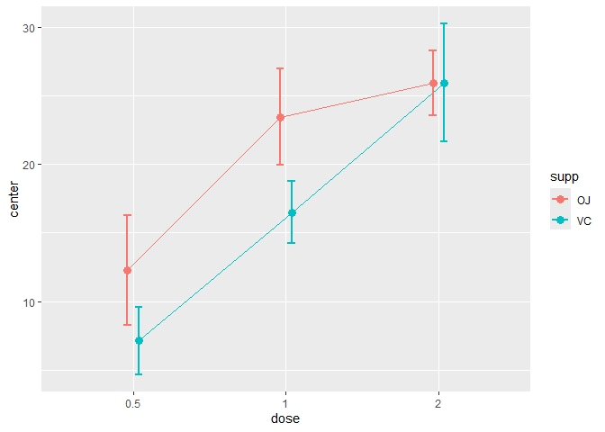
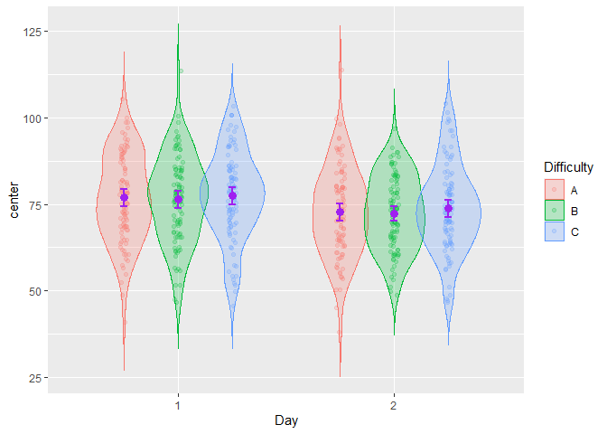

# superb: Summary plots with adjusted error bars


<!-- badges: start -->

[](https://cran.r-project.org/package=superb)
<!-- badges: end -->

The library `superb` offers two main functionalities. First, it can be
used to obtain plots with adjusted error bars. The main function is
`superbPlot()` but you can also use `superbShiny()` for a graphical user
interface requiring no programming nor scripting. See the nice tutorial
by Walker (2021).

The purpose of `superbPlot()` is to provide a plot with summary
statistics and correct error bars. With simple adjustments, the error
bar are adjusted to the design (within or between), to the purpose
(single or pair-wise differences), to the sampling method (simple
randomized samples or cluster randomized samples) and to the population
size (infinite or of a specific size). The `superbData()` function does
not generate the plot but returns the summary statistics and the
interval boundaries. These can afterwards be sent to other plotting
environment.

The second functionality is to generate random datasets. The function
`GRD()` is used to easily generate random data from any design (within
or between) using any population distribution with any parameters, and
with various effect sizes. `GRD()` is useful to test statistical
procedures and plotting procedures such as `superbPlot()`.

# Installation

The official **CRAN** version can be installed with

``` r
install.packages("superb")
library(superb)
```

The development version 0.95.202402 can be accessed through GitHub:

``` r
devtools::install_github("dcousin3/superb")
library(superb)
```

# Examples

The easiest is to use the graphical interface which can be launched with

``` r
superbShiny()
```

The following examples use the script-based commands.

Here is a simple example illustrating the `ToothGrowth` dataset of rats
(in which the dependent variable is `len`) as a function of the `dose`
of vitamin and the form of the vitamin supplements `supp` (pills or
juice)

``` r
superbPlot(ToothGrowth, 
    BSFactors = c("dose","supp"), 
    variables = "len" )
```

<!-- -->

In the above, the default summary statistic, the mean, is used. The
error bars are, by default, the 95% confidence intervals. These two
choices can be changed with the `statistic` and the `errorbar`
arguments.

This second example explicitly indicates to display the `median` instead
of the default `mean` summary statistics

``` r
superbPlot(ToothGrowth, 
    BSFactors = c("dose","supp"), 
    variables = "len",
    statistic = "median")
```

<!-- -->

As a third example, we illustrate the harmonic means `hmean` along with
99.9% confidence intervals using lines:

``` r
superbPlot(ToothGrowth, 
    BSFactors = c("dose","supp"), 
    variables = "len",
    statistic = "hmean", 
    errorbar = "CI", gamma = 0.999,
    plotStyle = "line")
```

<!-- -->

The second function, `GRD()`, can be used to generate random data from
designs with various within- and between-subject factors. This example
generates scores for 300 simulated participants in a 3 x 2 design with
repeated-measures on `Day`s. Only the factor `Day` is modeled as
impacting the scores (the reduce by 3 points on the second day):

``` r
testdata <- GRD(
    RenameDV   = "score", 
    SubjectsPerGroup = 100, 
    BSFactors  = "Difficulty(A,B,C)", 
    WSFactors  = "Day(2)",
    Population = list(mean = 75,stddev = 12,rho = 0.5),
    Effects    = list("Day" = slope(-3) )
)
head(testdata)
```

    ##   id Difficulty  score.1  score.2
    ## 1  1          A 66.58902 69.94894
    ## 2  2          A 76.89768 62.63307
    ## 3  3          A 77.81377 79.81806
    ## 4  4          A 62.53009 78.53439
    ## 5  5          A 54.68521 67.90889
    ## 6  6          A 78.16072 68.58369

The simulated scores are illustrated using using a more elaborated
layout, the `pointjitterviolin` which, in addition to the mean and
confidence interval, shows the raw data using jitter dots and the
distribution using a violin plot:

``` r
superbPlot(testdata, 
    BSFactors  = "Difficulty", 
    WSFactors  = "Day(2)",
    variables = c("score.1","score.2"),
    plotStyle = "pointjitterviolin",
    errorbarParams = list(color = "purple"),
    pointParams = list( size = 3, color = "purple")
)
```

<!-- -->

In the above example, optional arguments `errorbarParams` and
`pointParams` are used to inject specifications in the error bars and
the points respectively. When these arguments are used, they override
the defaults from `superbPlot()`.

# For more

As seen, the library `superb` makes it easy to illustrate summary
statistics along with the error bars. Some layouts can be used to
visualize additional characteristics of the raw data. Finally, the
resulting appearance can be customized in various ways.

The complete documentation is available on this
[site](https://dcousin3.github.io/superb/).

A general introduction to the `superb` framework underlying this library
is published at *Advances in Methods and Practices in Psychological
Sciences* (Cousineau, Goulet, & Harding, 2021).

# References

<p>
Cousineau D, Goulet M, Harding B (2021). “Summary plots with adjusted
error bars: The superb framework with an implementation in R.”
<em>Advances in Methods and Practices in Psychological Science</em>,
<b>2021</b>, 1–46. doi: <https://doi.org/10.1177/25152459211035109>
</p>
<p>
Walker, J. A. L. (2021). “Summary plots with adjusted error bars
(superb).” <em>Youtube video</em>,
<b><a href="https://www.youtube.com/watch?v=rw_6ll5nVus">accessible
here</a></b>.
</p>

<div id="refs" class="references csl-bib-body hanging-indent"
line-spacing="2">

<div id="ref-w21" class="csl-entry">

Walker, J. A. L. (2021). *Summary plots with adjusted error bars
(superb)*. Retrieved from <https://www.youtube.com/watch?v=rw_6ll5nVus>

</div>

</div>
