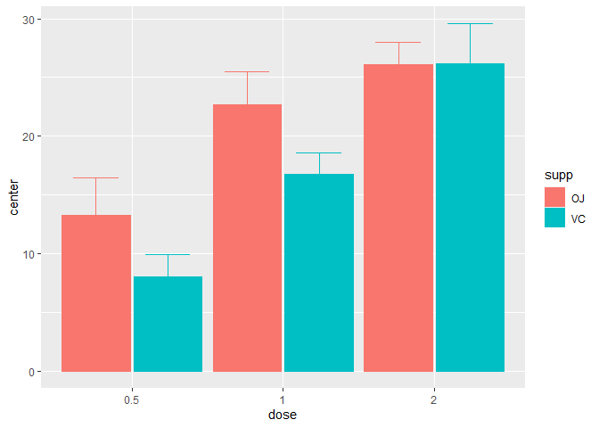
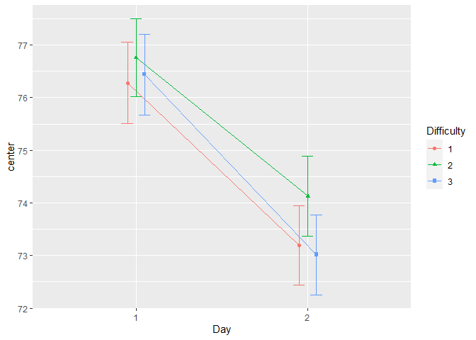

# superb: Summary statistics plotted with correct error bars


<!-- badges: start -->

[](https://cran.r-project.org/package=superb)
<!-- badges: end -->

The library `superb` offers two main functions, `superbPlot()` and
`GRD()`. The purpose of `superbPlot()` is to provide a plot with summary
statistics and correct error bars. With simple adjustments, the error
bar are adjusted to the design (within or between), to the purpose
(single or pair-wise differences), to the sampling method (simple
randomized samples or cluster randomized samples) and to the population
size (infinite or of a specific size).

`GRD()` can easily generate random data from any design (within or
between) using any population distribution with any parameters, and with
various effect sizes. GRD is useful to test statistical procedures such
as `aov()` or plotting procedures such as `superbPlot()`.

# Installation

``` r
install.packages("superb")
library(superb)
```

# Examples

This is a simple example illustrating the ToothGrowth of rats as a
function of the dose of vitamin and the form of the vitamin (pills or
juice)

``` r
superbPlot(ToothGrowth, 
    BSFactor = c("dose","supp"), 
    variables = "len" )
```

<!-- -->

This explicitely indicates to display the median instead of the default
mean statistics

``` r
superbPlot(ToothGrowth, 
    BSFactor = c("dose","supp"), 
    variables = "len",
    statistic = "median")
```

<!-- -->

This example generates scores for 3000 simulated participants in a 3 x 2
design with repeated-measures on days. The factor day is belived to
improve the scores (reducing it)

``` r
testdata <- GRD(
    RenameDV   = "score", 
    SubjectsPerGroup = 1000, 
    BSFactors  = "Difficulty(3)", 
    WSFactors  = "Day(2)",
    Population = list(mean = 75,stddev = 12,rho = 0.5),
    Effects    = list("Day" = slope(-3) )
)
head(testdata)
```

    ##   id Difficulty  score.1  score.2
    ## 1  1          1 62.49679 69.72102
    ## 2  2          1 81.75847 79.13177
    ## 3  3          1 79.96406 49.84184
    ## 4  4          1 62.37338 69.49319
    ## 5  5          1 79.74607 69.16255
    ## 6  6          1 67.03875 78.16241

``` r
superbPlot(testdata, 
    BSFactor  = "Difficulty", 
    WSFactor  = "Day(2)",
    variables = c("score.1","score.2"),
    plotStyle = "line"
)
```

<!-- -->

# For more

Consult the documentation, of the vignettes.

A general introduction to the `superb` framework is under consideration
at *Advances in Methods and Practices in Psychological Sciences*.
