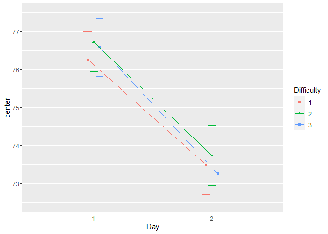
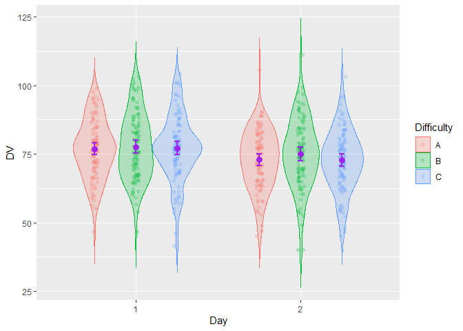

# superb: Summary plots with adjusted error bars


<!-- badges: start -->

[](https://cran.r-project.org/package=superb)
<!-- badges: end -->

The library `superb` offers three main functions, `superbPlot()`,
`superbData()` and `GRD()`. The purpose of `superbPlot()` is to provide
a plot with summary statistics and correct error bars. With simple
adjustments, the error bar are adjusted to the design (within or
between), to the purpose (single or pair-wise differences), to the
sampling method (simple randomized samples or cluster randomized
samples) and to the population size (infinite or of a specific size).

The `superbData()` function does not generate the plot but returns the
summary statistics and the interval boundaries. These can afterwards be
output to other plotting environment.

`GRD()` is used to easily generate random data from any design (within
or between) using any population distribution with any parameters, and
with various effect sizes. `GRD()` is useful to test statistical
procedures and plotting procedures such as `superbPlot()`.

# Installation

The official **CRAN** version can be installed with

``` r
install.packages("superb")
library(superb)
```

The development version can be accessed through GitHub:

``` r
devtools::install_github("dcousin3/superb")
library(superb)
```

# Examples

This is a simple example illustrating the ToothGrowth (dependent
variable is `len`) of rats as a function of the `dose` of vitamin and
the form of the vitamin `supp` (pills or juice)

``` r
superbPlot(ToothGrowth, 
    BSFactors = c("dose","supp"), 
    variables = "len" )
```

<!-- -->

In the above, the default summary statistic, the mean, is used. The
error bars are, by default, the 95% confidence intervals. These two
choices can be changed with the `statistic` and the `errorbar`
arguments.

This second example explicitly indicates to display the `median` instead
of the default `mean` summary statistics

``` r
superbPlot(ToothGrowth, 
    BSFactors = c("dose","supp"), 
    variables = "len",
    statistic = "median")
```

<!-- -->

As a third example, we illustrate the harmonic means `hmedian` along
with 99.9% confidence intervals using lines:

``` r
superbPlot(ToothGrowth, 
    BSFactors = c("dose","supp"), 
    variables = "len",
    statistic = "hmean", 
    errorbar = "CI", gamma = 0.999,
    plotStyle = "line")
```

<!-- -->

The second function, `GRD()`, can be used to generate random data from
designs with various within- and between-subject factors. This example
generates scores for 300 simulated participants in a 3 x 2 design with
repeated-measures on `Day`s. Only the factor `Day` is simulated to
improve the scores by reducing it:

``` r
testdata <- GRD(
    RenameDV   = "score", 
    SubjectsPerGroup = 100, 
    BSFactors  = "Difficulty(A,B,C)", 
    WSFactors  = "Day(2)",
    Population = list(mean = 75,stddev = 12,rho = 0.5),
    Effects    = list("Day" = slope(-3) )
)
head(testdata)
```

    ##   id Difficulty  score.1  score.2
    ## 1  1          A 76.51593 85.99830
    ## 2  2          A 84.91497 52.98343
    ## 3  3          A 54.13190 67.23024
    ## 4  4          A 63.91156 59.12050
    ## 5  5          A 87.95490 65.25933
    ## 6  6          A 82.74399 60.58499

The simulated scores are illustrated using using a more elaborated
layout, the `pointjitterviolin` which, in addition to the mean and
confidence interval, shows the raw data using jitter dots and the
distribution using a violin plot:

``` r
superbPlot(testdata, 
    BSFactors  = "Difficulty", 
    WSFactors  = "Day(2)",
    variables = c("score.1","score.2"),
    plotStyle = "pointjitterviolin",
    errorbarParams = list(color = "purple"),
    pointParams = list( size = 3, color = "purple")
)
```

<!-- -->

In the above example, optional arguments `errorbarParams` and
`pointParams` are used to inject specifications in the error bars and
the points respectively. When these arguments are used, they override
the defaults from `superbPlot()`.

# For more

As seen, the library `superb` makes it easy to illustrate summary
statistics along with the error bars. Some layouts can be used to
visualize additional characteristics of the raw data. Finally, the
resulting appearance can be customized in various ways.

The complete documentation is available on this
[site](https://dcousin3.github.io/superb).

A general introduction to the `superb` framework underlying this library
is under consideration at *Advances in Methods and Practices in
Psychological Sciences*.
