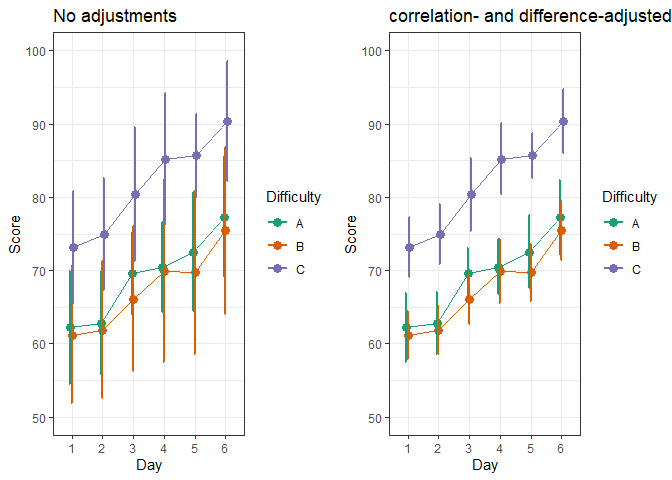

# superb: Summary plots with adjusted error bars


<!-- badges: start -->

[](https://cran.r-project.org/package=superb)
<!-- badges: end -->

The library `superb` offers two main functionalities. The first and
foremost functionnality is to obtain plots with adjusted error bars. The
main function is `superb()` but you can also use `superbShiny()` for a
graphical user interface requiring no programming nor scripting. See the
nice tutorial by Walker (2021).

The purpose of the function `superb()` is to provide a plot with summary
statistics and correct error bars. With simple adjustments, the error
bar are adjusted to the design (within or between), to the purpose
(single or pair-wise differences), to the sampling method (simple
randomized samples or cluster randomized samples) and to the population
size (infinite or of a specific size). The `superb(..., showPlot=FALSE)`
argument does not generate the plot but returns the summary statistics
and the interval boundaries. These can afterwards be sent to other
plotting environments.

The second, subsidiary, functionality is to *Generate Random Datasets*.
The function `GRD()` is used to easily generate random data from any
design (within or between) using any population distribution with any
parameters, and with various effect sizes. `GRD()` is quite handy to
test statistical procedures and plotting procedures such as `superb()`.

# Installation

The official **CRAN** version can be installed with

``` r
install.packages("superb")
library(superb)
```

The development version 0.95.22 can be accessed through GitHub:

``` r
devtools::install_github("dcousin3/superb")
library(superb)
```

# Examples

The easiest is to use the graphical interface which can be launched with

``` r
superbShiny()
```

The following examples use the script-based commands.

Here is a simple example illustrating the `ToothGrowth` dataset of rats
(in which the dependent variable is `len`) as a function of the `dose`
of vitamin and the form of the vitamin supplements `supp` (pills or
juice)

``` r
superb(len ~ dose + supp, ToothGrowth )
```

<!-- -->

In the above, the default summary statistic, the mean, is used. The
error bars are, by default, the 95% confidence intervals (of the mean).
These two choices can be changed with the `statistic` and the `errorbar`
arguments.

This second example explicitly indicates to display the `median` instead
of the default `mean` summary statistics along with the default 95%
confidence interval of the median here (the correct function is
automatically selected):

``` r
superb(len ~ dose + supp, ToothGrowth,
    statistic = "median")
```

<!-- -->

As a third example, we illustrate the harmonic means `hmean` along with
99.9% confidence intervals of the harmonic mean displayed using bars:

``` r
superb(len ~ dose + supp, ToothGrowth,
    statistic = "hmean", 
    errorbar = "CI", gamma = 0.999,
    plotLayout = "bar")
```

<!-- -->

The second function, `GRD()`, can be used to generate random data from
designs with various within- and between-subject factors. This example
generates scores for 30 simulated participants in a 3 x 6 design with 6
daily repeated-measures on `Day`s. Only the factor `Day` is modeled as
impacting the scores (increasing by 3 points on the second day):

``` r
set.seed(663) # for reproducibility
testdata <- GRD(
    RenameDV   = "score", 
    SubjectsPerGroup = 10, 
    BSFactors  = "Difficulty(A,B,C)", 
    WSFactors  = "Day(6)",
    Population = list(mean = 75,stddev = 10,rho = 0.8),
    Effects    = list( "Difficulty" =  custom(-5,-5,+10), "Day" = slope(3) )
) 
head(testdata)
```

    ##   id Difficulty  score.1  score.2  score.3  score.4  score.5  score.6
    ## 1  1          A 61.72393 61.48460 70.48406 68.92430 69.85908 68.15339
    ## 2  2          A 54.16784 65.82688 66.51785 65.59598 82.74906 82.53300
    ## 3  3          A 69.85369 60.04088 73.99657 72.95358 69.89209 74.30423
    ## 4  4          A 69.05319 64.99568 75.00310 78.35253 81.48167 76.08335
    ## 5  5          A 79.29388 81.56254 78.17444 86.36108 92.45310 93.73091
    ## 6  6          A 56.56657 59.23395 66.10074 63.77299 67.07331 72.64133

This is here that the full benefits of `superb()` is seen: with just a
few adjustments, you can obtained decorrelated error bars with the
Correlation-adjusted (CA), the Cousineau-Morey (CM) or the Loftus &
Masson (CM) techniques:

``` r
library(gridExtra)          # for grid.arrange
```

    ## Warning: package 'gridExtra' was built under R version 4.3.3

``` r
library(RColorBrewer)       # for nicer color palette
```

    ## Warning: package 'RColorBrewer' was built under R version 4.3.1

``` r
plt1 <- superb( crange(score.1, score.6) ~ Difficulty, 
    testdata, WSFactors = "Day(6)",
    plotLayout = "line"
) + ylim(50,100) + labs(title = "No adjustments") +
theme_bw() + ylab("Score") +
scale_color_brewer(palette="Dark2")
    
plt2 <- superb( crange(score.1, score.6) ~ Difficulty, 
    testdata, WSFactors = "Day(6)",
    adjustments = list(purpose = "difference", decorrelation = "CA"),
    plotLayout = "line"
)+ ylim(50,100) + labs(title = "correlation- and difference-adjusted") +
theme_bw() + ylab("Score") +
scale_color_brewer(palette="Dark2")

grid.arrange(plt1,plt2, ncol=2)
```

<!-- -->

Even better, the simulated scores can be illustrated using more
elaborate layouts such as the `pointjitter` layout which, in addition to
the mean and confidence interval, shows the raw data using jitter dots:

``` r
superb( crange(score.1, score.6) ~ Difficulty, 
    testdata, WSFactors = "Day(6)",
    adjustments = list(purpose = "difference", decorrelation = "CM"),
    plotLayout = "pointjitter",
    errorbarParams = list(color = "purple"),
    pointParams = list( size = 3, color = "purple")
) +
theme_bw() + ylab("Score") +
scale_color_brewer(palette="Dark2")
```

<!-- -->

In the above example, optional arguments `errorbarParams` and
`pointParams` are used to inject specifications in the error bars and
the points respectively. When these arguments are used, they override
the defaults from `superb()`.

Lastly, we could aim for a radar (a.k.a. circular) plot with

``` r
superb( crange(score.1, score.6) ~ Difficulty, testdata, 
    WSFactors = "Day(6)",
    adjustments = list(purpose = "difference", decorrelation = "CM"),
    plotLayout = "circularpointlinejitter",
    factorOrder = c("Day", "Difficulty"),
    pointParams = list( size = 3 ),
    jitterParams = list(alpha=0.25),
    errorbarParams= list(width=0.33, color = "black")
) +
theme_bw() + ylab("") +
theme(panel.border = element_blank(), text = element_text(size = 16) ) +
scale_color_brewer(palette="Dark2") +
theme(axis.line.y = element_blank(), 
axis.text.y=element_blank(), axis.ticks.y=element_blank())
```

<!-- -->

Every time, you get error bars for free! no need to compute them on the
side, no need to worry about the adjustments (whether you want
stand-alone error bars or adjusted for purpose or correlation, it is all
just one option). Also, keep in mind that it is easy to change the
default (mean +- 95% confidence intervals) to any other summary
statistics –e.g., median– and any other measure of error –e.g., standard
error, standard deviation, inter-quartile range, name it–; you can find
some responses in the vignettes or on stackExchange or just open an
issue on the github repository.

# For more

*superb* is for **summary plot with error bars**, as simple as that.

The library `superb` makes it easy to illustrate summary statistics
along with error bars. Some layouts can be used to visualize additional
characteristics of the raw data. Finally, the resulting appearance can
be customized in various ways.

The complete documentation is available on this
[site](https://dcousin3.github.io/superb/).

A general introduction to the `superb` framework underlying this library
is published at *Advances in Methods and Practices in Psychological
Sciences* (Cousineau, Goulet, & Harding, 2021). Also, most of the
formulas for confidence intervals when statistics other than the mean
are displayed can be found in Harding, Tremblay, & Cousineau (2015).

# References

<div id="refs" class="references csl-bib-body hanging-indent"
entry-spacing="0" line-spacing="2">

<div id="ref-cgh21" class="csl-entry">

Cousineau, D., Goulet, M.-A., & Harding, B. (2021). Summary plots with
adjusted error bars: The superb framework with an implementation in R.
*Advances in Methods and Practices in Psychological Science*, *4*, 1–18.
<https://doi.org/10.1177/25152459211035109>

</div>

<div id="ref-htc14" class="csl-entry">

Harding, B., Tremblay, C., & Cousineau, D. (2014). Standard errors: A
review and evaluation of standard error estimators using monte carlo
simulations. *The Quantitative Methods for Psychology*, *10*(2),
107–123.

</div>

<div id="ref-htc15" class="csl-entry">

Harding, B., Tremblay, C., & Cousineau, D. (2015). The standard error of
the pearson skew. *The Quantitative Methods for Psychology*, *11*(1),
32–36.

</div>

<div id="ref-w21" class="csl-entry">

Walker, J. A. L. (2021). *Summary plots with adjusted error bars
(superb) \[youtube video\]*. Retrieved from
<https://www.youtube.com/watch?v=rw_6ll5nVus>

</div>

</div>
